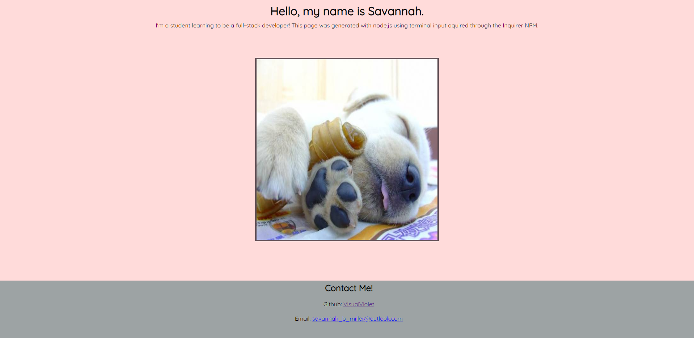

# Portfolio Generator

## Description

This portfolio generator is a node.js application that takes input using Inquirer(NPM) and generates a tailored profile page. The terminal will ask for a name, bio, GitHub Username, email, and a choice of photo. In the past week of the UW Coding Bootcamp, we have been learning how to use node.js and install code packages through npm. This project showcases what I have learned and gave me valuable practice for my upcoming code challenge.

## Installation

No installation is necessary, but since this is an undeployed application, screenshots and code comments have been provided to show functionality.

## Usage

New developers and students who are learning node.js may use this project to supplement learning. Look through the code and comments to see how everything is working together. In the console, this application is run through integrated terminal with the command "node index.js". Inquirer will propmt the user with questions and generate an HTML file.

## Credits

N/A

## License

MIT License Copyright (c) 2023 VisualViolet